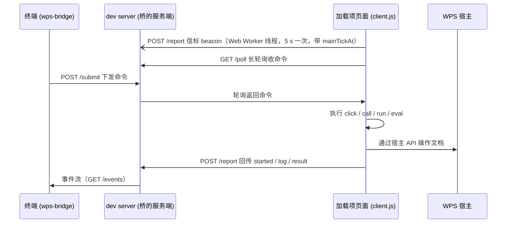

# 开发文档

面向改这个包的人（以及想弄清它为什么这么写的人）。用法见 [README](../README.md)，
命令与选项见 [reference.md](reference.md)。

## 工作原理



三个角色各一个文件：

| 角色 | 文件 | 职责 |
| --- | --- | --- |
| 页面侧 | [src/client.js](../src/client.js) | 长轮询收命令、在页面里执行、回传日志与结果 |
| 服务端 | [src/bridge.js](../src/bridge.js) + [src/server.js](../src/server.js) | 命令队列、事件日志、客户端状态；HTTP 路由与门禁 |
| 终端侧 | [src/runner.js](../src/runner.js) | 下发与重发、流式打印、按 reporter 定退出码 |

`src/bridge.js` 是纯簿记（不碰网络），所以可以脱离 HTTP 直接测 —— 见
[test/bridge.test.js](../test/bridge.test.js)。`src/vite-plugin.js` 只是一层把
`server.js` 接到 vite 上的薄壳。

## 那些“为什么不这么写”的答案在哪

行为上的取舍都写在**对应文件的文档注释里**，改代码前先读那段（比读文档可靠）：

| 想搞清楚 | 去看 |
| --- | --- |
| 命令为什么要有 clientId、重发为什么要复用 id | [src/bridge.js](../src/bridge.js) 顶部与 `createCommandQueue` |
| 为什么页面侧要按 id 去重、为什么日志带 commandId | [src/client.js](../src/client.js) 顶部与 `handleCommand` |
| 为什么执行要有上限、为什么信标要放在 Web Worker | [src/client.js](../src/client.js) `withTimeout`、`startBeacons` |
| 客户端状态（idle/busy/stalled/offline）是怎么推导的 | [src/bridge.js](../src/bridge.js) `createClientRegistry` |
| 事件日志为什么是环形的、丢了怎么告知 | [src/bridge.js](../src/bridge.js) `createEventLog` |
| 为什么只放本机同源、token 怎么流转 | [src/server.js](../src/server.js) `defaultOriginGuard`、`announce` |
| 为什么 stdout/stderr 要分开 | [src/logger.js](../src/logger.js) 顶部 |
| 为什么 reporter 是可替换的 | [src/reporters.js](../src/reporters.js) 顶部 |
| 协议版本不一致会怎样 | [src/protocol.js](../src/protocol.js) `PROTOCOL_VERSION` |

## 目录结构

```text
bin/cli.js            # wps-bridge 命令入口（薄壳：调 runner.main）
src/protocol.js       # 共享常量与报告解析（浏览器安全，页面侧也 import 它）
src/client.js         # 页面侧客户端（由 dev server 注入）
src/bridge.js         # 核心簿记：命令队列 / 事件环 / 客户端状态
src/server.js         # HTTP 适配：路由、门禁、端口文件、注入
src/vite-plugin.js    # vite 插件（薄壳）
src/runner.js         # 终端侧实现
src/logger.js         # 桥自己的诊断输出（走 stderr）
src/reporters.js      # regex / json / 自定义 reporter
src/*.d.ts            # 两个公开入口的类型声明
test/                 # 单元测试 + 端到端测试
test/fixtures/        # 页面模拟器、模块解析钩子、专用用例
examples/             # 三个 Hello World 加载项示例
docs/                 # 本文件与参考手册
```

## 测试

```shell
npm test
```

`npm test` 干两件事：

1. **单元测试**：参数解析、报告解析、桥核心（队列 / 事件环 / 客户端状态）、
   HTTP 层（路由 / 门禁 / 端口文件）、声明文件与实现是否一致；
2. **端到端测试**（[test/examples.test.js](../test/examples.test.js)）：把 `examples/` 里三个示例
   真的跑起来 —— 起一个挂了桥的 http 服务，用 [test/fixtures/page.mjs](../test/fixtures/page.mjs)
   造一个「WPS 加载项页面」（装上宿主替身，再真的加载 `src/client.js`），
   然后用终端侧下发 `run` / `click` / `eval`，断言退出码、两条输出通道与宿主里的结果。
   **不需要安装 WPS**，也不需要装示例的依赖。

几个刻意为之的地方：

- **不用 `node --test` 的无参模式**：`examples/*/test/*.test.js` 是示例自己的测试模块，
  得在加载项页面里跑，不能当 Node 测试直接执行。所以 `package.json` 里显式列了测试文件。
- **页面模拟器用 Node 22.18+ 的原生类型擦除**执行示例里的 `.ts`；旧版本上相关用例自动 `skip`。
- **模块解析钩子**（[test/fixtures/resolve-root.mjs](../test/fixtures/resolve-root.mjs)）扮演 dev server：
  把 `/test/x.ts`、`/@fs/<绝对路径>` 映射到磁盘文件，并保留 `?t=` 这类 cache-busting 参数。
- 测试里创建中间件要显式传 `portFile: false`，否则会往仓库里写 `.wps-bridge.json`。

## 约定

- **代码风格**：ESM、无分号、双引号、2 空格；注释写“为什么”，不写“做了什么”。
- **示例保持自包含**：`examples/` 下每个示例都能单独拷走（所以各带一份相同的 `test/mini-test.js`，
  刻意不互相依赖）。改动示例时三个一起改，并更新各自的 README。
- **页面侧不能有依赖**：`src/client.js` 与 `src/protocol.js` 必须是浏览器安全的纯 ESM，
  不能出现 Node 专有 API（它们会被注入到 WPS 宿主里）。
- **加一个 CLI 选项**要动的地方：`parseArgs` → `USAGE` → 选项表（[reference.md](reference.md)）；
  如果它影响页面行为，还要同步 `bridgeClientOptions`。
- **改公开导出**：`src/server.d.ts` / `src/vite-plugin.d.ts` 是手写的，
  忘了改会被 `test/types.test.js` 拦下来。
